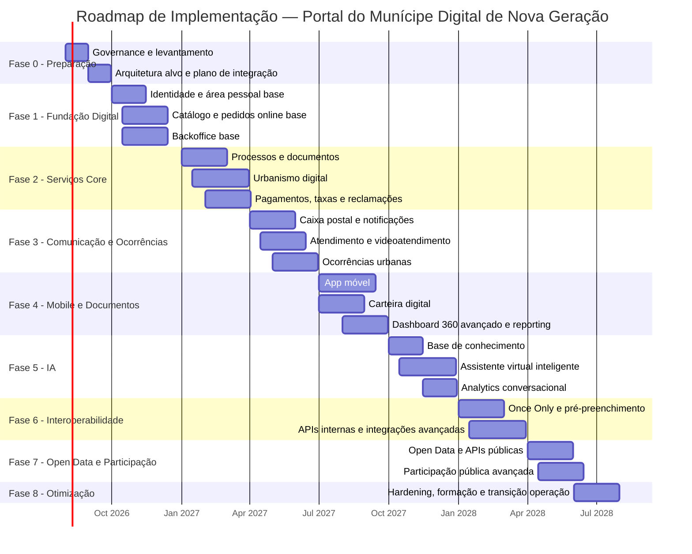

# Matriz RFP Detalhada — Portal do Munícipe Digital de Nova Geração

**Município de referência:** Câmara Municipal de Sintra  
**Documento:** Matriz RFP detalhada com todas as funcionalidades identificadas para um Portal do Munícipe de nova geração  
**Formato:** Markdown compatível com VS Code  
**Versão:** 2.0  
**Data:** 2026-07-14  

---

## 1. Objetivo do Documento

Este documento consolida uma matriz RFP detalhada para uma plataforma digital municipal orientada ao cidadão/munícipe, incluindo funcionalidades atualmente esperadas num portal municipal moderno e funcionalidades avançadas inspiradas em boas práticas internacionais de governo digital local.

A matriz inclui requisitos para:

- Serviços online ao munícipe
- Área pessoal 360º
- Gestão de pedidos e processos
- Urbanismo digital
- Reclamações, petições e ocorrências
- Pagamentos, taxas e licenças
- Caixa postal digital e notificações
- Assistente virtual inteligente
- Atendimento por videoconferência
- Carteira digital de documentos
- App móvel integrada
- Participação pública e orçamento participativo
- Open Data e APIs públicas
- Backoffice, workflows e administração
- Segurança, acessibilidade, integração, migração e operação
- Roadmap de implementação com timeline

> Nota: Este documento não inclui critérios de avaliação da proposta, conforme solicitado.

---

## 2. Legenda de Prioridade

| Código | Prioridade | Descrição |
|---|---|---|
| M | Mandatory | Obrigatório para a solução mínima aceitável |
| H | High | Elevada importância; deve ser considerado no desenho da solução |
| N | Nice to Have | Funcionalidade desejável, mas não bloqueante |

---

## 3. Legenda de Resposta do Concorrente

| Código | Resposta | Descrição |
|---|---|---|
| S | Standard | Disponível de base na solução proposta |
| C | Configurável | Disponível por configuração, sem desenvolvimento específico |
| D | Desenvolvimento específico | Requer desenvolvimento ou customização |
| P | Produto terceiro | Requer integração com produto/plataforma externa |
| N | Não disponível | Não suportado pela solução proposta |

---

## 4. Campos Sugeridos para Preenchimento pelo Concorrente

| Campo | Descrição |
|---|---|
| Resposta Concorrente | S / C / D / P / N |
| Descrição da Solução | Explicação objetiva de como o requisito é cumprido |
| Evidência | Link, documentação, screenshot, demo ou referência de implementação |
| Esforço | Baixo / Médio / Alto |
| Custo Adicional | Sim / Não / Valor, quando aplicável |
| Prazo de Disponibilização | Disponível / Curto prazo / Médio prazo / Desenvolvimento |
| Dependências | Dependências técnicas, funcionais, legais ou organizacionais |
| Comentários | Observações adicionais do concorrente |

---

# 5. Matriz RFP Funcional

---

## MÓDULO 1 — Identidade, Autenticação e Gestão de Conta

| ID | Requisito | Descrição Detalhada | Prioridade | Critério de Aceitação | Resposta Concorrente | Comentários |
|---|---|---|---|---|---|---|
| ID-001 | Registo de utilizador | A solução deve permitir o registo de munícipes, empresas e representantes legais. | M | Utilizadores conseguem criar conta com dados mínimos obrigatórios e validação de contacto. |  |  |
| ID-002 | Login seguro | A solução deve disponibilizar autenticação segura para acesso à área reservada. | M | Utilizador autenticado acede apenas aos seus dados e serviços autorizados. |  |  |
| ID-003 | Integração com identidade digital pública | A solução deve suportar integração com mecanismos nacionais/europeus de identidade digital, quando definidos pela entidade adjudicante. | M | Login com identidade digital externa validado em ambiente de testes. |  |  |
| ID-004 | Autenticação multifator | A solução deve suportar MFA para operações sensíveis. | H | Operações críticas exigem segundo fator ou mecanismo equivalente. |  |  |
| ID-005 | Recuperação de conta | A solução deve permitir recuperação segura de acesso. | M | Utilizador recupera acesso através de processo validado e auditável. |  |  |
| ID-006 | Gestão de perfil | A solução deve permitir consultar e atualizar dados de perfil, contactos e preferências. | M | Utilizador consegue atualizar dados permitidos e consultar histórico de alterações. |  |  |
| ID-007 | Representação de terceiros | A solução deve permitir representação de empresa, agregado, mandatário ou representante legal. | H | Utilizador autorizado consegue atuar em nome de entidade representada com permissões explícitas. |  |  |
| ID-008 | Gestão de consentimentos | A solução deve permitir registar, consultar e revogar consentimentos. | M | Consentimentos estão associados a finalidade, data, canal e versão dos termos. |  |  |
| ID-009 | Sessão segura | A solução deve gerir expiração de sessão, logout e proteção contra sessão inativa. | M | Sessões expiram automaticamente conforme política definida. |  |  |
| ID-010 | Auditoria de acesso | A solução deve registar acessos, tentativas falhadas e operações críticas. | M | Logs auditáveis incluem utilizador, data/hora, IP/origem, ação e resultado. |  |  |

---

## MÓDULO 2 — Área Pessoal 360º do Munícipe

| ID | Requisito | Descrição Detalhada | Prioridade | Critério de Aceitação | Resposta Concorrente | Comentários |
|---|---|---|---|---|---|---|
| AP-001 | Dashboard único | A solução deve disponibilizar uma área inicial autenticada com visão consolidada do munícipe. | M | O munícipe visualiza processos, pedidos, notificações, pagamentos, marcações e documentos num único ecrã. |  |  |
| AP-002 | Cartões de resumo | O dashboard deve apresentar cartões de resumo com indicadores pessoais. | M | Cartões mostram processos ativos, notificações por ler, pagamentos pendentes, marcações futuras e ocorrências abertas. |  |  |
| AP-003 | Timeline do cidadão | A solução deve apresentar histórico cronológico de interações do munícipe. | H | Timeline mostra submissões, alterações de estado, comunicações, pagamentos e atendimentos. |  |  |
| AP-004 | Atalhos rápidos | A solução deve disponibilizar atalhos para serviços frequentes. | H | Atalhos incluem fazer pedido, reportar ocorrência, consultar taxas, marcar atendimento e urbanismo online. |  |  |
| AP-005 | Personalização da área pessoal | A solução deve permitir ao munícipe personalizar widgets e serviços favoritos. | N | Utilizador consegue ativar/ocultar/reordenar widgets. |  |  |
| AP-006 | Pesquisa transversal | A solução deve permitir pesquisa global em processos, pedidos, documentos, mensagens e serviços. | M | Pesquisa devolve resultados categorizados e filtráveis. |  |  |
| AP-007 | Filtros e ordenação | A solução deve permitir filtrar informação por data, estado, serviço, processo e tipo. | H | Utilizador consegue encontrar rapidamente informação específica. |  |  |
| AP-008 | Vista de pendências | A solução deve destacar ações pendentes do munícipe. | M | Dashboard mostra prazos, pagamentos, pedidos de elementos e notificações críticas. |  |  |
| AP-009 | Estado consolidado por processo | A solução deve apresentar uma vista integrada por processo. | M | Processo mostra dados principais, documentos, comunicações, pagamentos e histórico. |  |  |
| AP-010 | Experiência responsiva | A área pessoal deve funcionar em desktop, tablet e smartphone. | M | Layout adapta-se corretamente a dispositivos e resoluções suportadas. |  |  |

---

## MÓDULO 3 — Catálogo de Serviços e Pedidos Online

| ID | Requisito | Descrição Detalhada | Prioridade | Critério de Aceitação | Resposta Concorrente | Comentários |
|---|---|---|---|---|---|---|
| CS-001 | Catálogo de serviços | A solução deve disponibilizar catálogo estruturado de serviços municipais. | M | Serviços organizados por tema, destinatário, unidade orgânica e canal de acesso. |  |  |
| CS-002 | Pesquisa de serviços | A solução deve permitir pesquisar serviços por palavra-chave, tema ou necessidade. | M | Pesquisa apresenta resultados relevantes e informação essencial do serviço. |  |  |
| CS-003 | Página informativa do serviço | Cada serviço deve ter página dedicada com descrição, requisitos, documentos, taxas, prazos e canais. | M | Serviço possui informação clara e atualizada. |  |  |
| CS-004 | Submissão de pedido online | A solução deve permitir iniciar e submeter pedidos administrativos online. | M | Munícipe consegue preencher formulário, anexar documentos e submeter pedido. |  |  |
| CS-005 | Formulários dinâmicos | A solução deve suportar formulários parametrizáveis por serviço. | M | Administrador funcional configura campos, validações e documentos obrigatórios. |  |  |
| CS-006 | Validação de campos | A solução deve validar dados obrigatórios, formatos e regras de negócio. | M | Erros são apresentados antes da submissão e com mensagem compreensível. |  |  |
| CS-007 | Guardar rascunho | A solução deve permitir guardar pedido em rascunho. | H | Munícipe retoma preenchimento posteriormente sem perda de dados. |  |  |
| CS-008 | Submissão assistida | A solução deve orientar o utilizador durante o preenchimento. | H | Formulário apresenta ajuda contextual e requisitos. |  |  |
| CS-009 | Comprovativo de submissão | A solução deve gerar comprovativo após submissão. | M | Comprovativo inclui número de pedido, data/hora, serviço e resumo. |  |  |
| CS-010 | Canais alternativos | A solução deve permitir registo de pedidos iniciados presencialmente, por telefone ou outros canais. | H | Backoffice regista pedido mantendo visão única do munícipe. |  |  |
| CS-011 | Anexação documental | A solução deve permitir upload de documentos em formatos definidos. | M | Documentos são validados, associados ao pedido e auditáveis. |  |  |
| CS-012 | Pedidos para empresas | A solução deve suportar pedidos submetidos por empresas ou representantes. | H | Perfil empresarial utiliza dados e permissões próprios. |  |  |

---

## MÓDULO 4 — Gestão e Acompanhamento de Processos

| ID | Requisito | Descrição Detalhada | Prioridade | Critério de Aceitação | Resposta Concorrente | Comentários |
|---|---|---|---|---|---|---|
| PR-001 | Número único de processo | A solução deve atribuir identificador único a cada processo/pedido. | M | Cada processo possui número único e rastreável. |  |  |
| PR-002 | Consulta de estado | O munícipe deve poder consultar o estado dos seus processos. | M | Estado atual e histórico estão disponíveis na área pessoal. |  |  |
| PR-003 | Estados normalizados | A solução deve suportar ciclo de vida normalizado dos processos. | M | Estados incluem submetido, em análise, pendente, deferido, indeferido, concluído, cancelado. |  |  |
| PR-004 | Histórico de tramitação | A solução deve disponibilizar histórico de alterações relevantes. | M | Histórico mostra data, evento, serviço responsável e observação quando aplicável. |  |  |
| PR-005 | Pedido de elementos | A solução deve permitir solicitar elementos adicionais ao munícipe. | M | Munícipe recebe notificação, responde e anexa documentos no processo. |  |  |
| PR-006 | Prazos e contadores | A solução deve suportar prazos legais/administrativos e contadores de SLA. | H | Backoffice visualiza prazos e alertas de incumprimento. |  |  |
| PR-007 | Comunicação associada ao processo | Comunicações devem estar associadas ao processo correspondente. | M | Processo apresenta mensagens, notificações e respostas relacionadas. |  |  |
| PR-008 | Documentos do processo | A solução deve apresentar documentos submetidos, gerados e emitidos. | M | Documentos são consultáveis no detalhe do processo. |  |  |
| PR-009 | Pagamentos associados | A solução deve associar taxas e pagamentos ao processo. | M | Estado do pagamento é visível no detalhe do processo. |  |  |
| PR-010 | Reabertura ou recurso | A solução deve permitir fluxos de resposta, reclamação, recurso ou reabertura quando aplicável. | H | Processo suporta ações pós-decisão parametrizadas. |  |  |

---

## MÓDULO 5 — Urbanismo Digital

| ID | Requisito | Descrição Detalhada | Prioridade | Critério de Aceitação | Resposta Concorrente | Comentários |
|---|---|---|---|---|---|---|
| URB-001 | Submissão de processos urbanísticos | A solução deve permitir submissão online de processos de urbanismo. | M | Munícipe/técnico submete processo com formulário, peças e documentos. |  |  |
| URB-002 | Gestão de peças desenhadas | A solução deve suportar upload e validação de peças desenhadas em formatos definidos. | M | Documentos técnicos são associados ao processo e versionados. |  |  |
| URB-003 | Assinatura digital de documentos | A solução deve suportar documentos assinados digitalmente, quando aplicável. | M | Documentos assinados são aceites e validados conforme regras definidas. |  |  |
| URB-004 | Consulta de processos urbanísticos | A solução deve permitir consulta do estado de processos de urbanismo. | M | Interessado autorizado consulta estado, documentos, taxas e comunicações. |  |  |
| URB-005 | Simulador de taxas urbanísticas | A solução deve permitir simulação de taxas relevantes para urbanismo. | H | Utilizador obtém estimativa antes ou durante a submissão. |  |  |
| URB-006 | Integração SIG/GIS | A solução deve integrar com sistemas de informação geográfica. | H | Processo pode ser associado a localização/parcela/mapa. |  |  |
| URB-007 | Certidões urbanísticas | A solução deve suportar pedido, emissão e disponibilização de certidões urbanísticas. | M | Certidão é emitida e disponibilizada na carteira digital. |  |  |
| URB-008 | Licenças e alvarás | A solução deve suportar emissão digital de licenças, alvarás e autorizações. | M | Documento emitido apresenta validade, código de validação e processo associado. |  |  |
| URB-009 | Pareceres internos | A solução deve permitir tramitação interna com pareceres por unidade orgânica. | H | Backoffice recolhe pareceres e consolida decisão. |  |  |
| URB-010 | Consulta pública urbanística | A solução deve suportar publicação de informação para consulta pública, quando aplicável. | N | Cidadãos conseguem consultar informação pública sem dados pessoais indevidos. |  |  |

---

## MÓDULO 6 — Reclamações, Petições, Sugestões e Elogios

| ID | Requisito | Descrição Detalhada | Prioridade | Critério de Aceitação | Resposta Concorrente | Comentários |
|---|---|---|---|---|---|---|
| RP-001 | Submissão de reclamação | A solução deve permitir submissão online de reclamações. | M | Munícipe submete reclamação com categoria, descrição e anexos. |  |  |
| RP-002 | Submissão de petição | A solução deve permitir submissão de petições ou exposições. | M | Petição gera referência e pode ser acompanhada. |  |  |
| RP-003 | Sugestões | A solução deve permitir submissão de sugestões de melhoria. | H | Sugestão é encaminhada para serviço competente. |  |  |
| RP-004 | Elogios | A solução deve permitir submissão de elogios. | N | Elogio é registado e tratado conforme workflow definido. |  |  |
| RP-005 | Classificação e encaminhamento | A solução deve classificar e encaminhar automaticamente ou manualmente a unidade responsável. | H | Reclamação/petição é atribuída a equipa/responsável. |  |  |
| RP-006 | Acompanhamento pelo munícipe | O munícipe deve poder consultar estado e resposta. | M | Estado e resposta final ficam disponíveis na área pessoal. |  |  |
| RP-007 | Resposta formal | A solução deve permitir emissão de resposta formal. | M | Resposta é disponibilizada na caixa postal digital. |  |  |
| RP-008 | Prazos de resposta | A solução deve permitir configurar prazos e alertas. | H | Backoffice visualiza reclamações próximas do prazo. |  |  |
| RP-009 | Relatórios de reclamações | A solução deve gerar relatórios por tema, serviço, estado e prazo. | H | Dados disponíveis para gestão e melhoria contínua. |  |  |
| RP-010 | Satisfação pós-tratamento | A solução deve permitir recolher feedback após encerramento. | N | Munícipe avalia qualidade da resposta/tratamento. |  |  |

---

## MÓDULO 7 — Reporte e Gestão de Ocorrências Urbanas

| ID | Requisito | Descrição Detalhada | Prioridade | Critério de Aceitação | Resposta Concorrente | Comentários |
|---|---|---|---|---|---|---|
| OC-001 | Reporte de ocorrência | A solução deve permitir reportar ocorrências urbanas digitalmente. | M | Munícipe submete ocorrência com categoria, descrição, localização e anexos. |  |  |
| OC-002 | Georreferenciação | A ocorrência deve poder ser marcada em mapa ou por localização do dispositivo. | M | Localização é registada com possibilidade de ajuste manual. |  |  |
| OC-003 | Upload de fotografias | A solução deve permitir anexar fotografias. | M | Fotografias ficam associadas à ocorrência. |  |  |
| OC-004 | Categorias de ocorrência | A solução deve suportar categorias configuráveis, como iluminação, resíduos, pavimento, jardins ou sinalização. | M | Administrador configura categorias e subcategorias. |  |  |
| OC-005 | Encaminhamento automático | A solução deve encaminhar ocorrência para equipa responsável com base em categoria/localização. | H | Ocorrência é atribuída automaticamente conforme regras. |  |  |
| OC-006 | Ciclo de vida da ocorrência | A solução deve suportar estados normalizados. | M | Estados incluem submetida, em análise, encaminhada, em execução, resolvida, encerrada. |  |  |
| OC-007 | Notificação de evolução | O munícipe deve receber atualizações de estado. | M | Alteração de estado gera notificação. |  |  |
| OC-008 | Evidência de resolução | A solução deve permitir anexar evidência de resolução. | H | Equipa adiciona descrição/foto de resolução. |  |  |
| OC-009 | SLA por tipo/território | A solução deve suportar prazos por categoria e localização. | H | Backoffice monitoriza cumprimento dos SLA. |  |  |
| OC-010 | Mapa operacional | Backoffice deve disponibilizar mapa de ocorrências. | H | Equipas visualizam ocorrências por zona, estado e prioridade. |  |  |
| OC-011 | Mapa público anonimizado | A solução deve poder disponibilizar mapa público de ocorrências não sensíveis. | N | Mapa não expõe dados pessoais. |  |  |
| OC-012 | Deteção de duplicados | A solução deve sugerir potenciais ocorrências duplicadas. | N | Sistema alerta utilizador/backoffice sobre ocorrências semelhantes na mesma zona. |  |  |

---

## MÓDULO 8 — Pagamentos, Taxas, Licenças e Multas

| ID | Requisito | Descrição Detalhada | Prioridade | Critério de Aceitação | Resposta Concorrente | Comentários |
|---|---|---|---|---|---|---|
| PG-001 | Consulta de taxas | A solução deve permitir consultar taxas municipais aplicáveis por serviço. | M | Munícipe visualiza taxas associadas ao serviço. |  |  |
| PG-002 | Simulador de taxas | A solução deve permitir simular valores antes da submissão. | H | Simulação apresenta pressupostos e valor estimado. |  |  |
| PG-003 | Pagamentos online | A solução deve suportar pagamento online ou geração de referência. | M | Pagamento é realizado e associado ao processo/pedido. |  |  |
| PG-004 | Pagamentos pendentes | A solução deve apresentar pagamentos em aberto na área pessoal. | M | Munícipe visualiza valor, referência, prazo e estado. |  |  |
| PG-005 | Confirmação de pagamento | A solução deve atualizar estado após confirmação. | M | Estado muda para pago após validação automática/manual. |  |  |
| PG-006 | Comprovativo de pagamento | A solução deve gerar comprovativo digital. | M | Comprovativo fica disponível na carteira digital. |  |  |
| PG-007 | Multas e contraordenações | A solução deve suportar consulta e pagamento de multas/contraordenações, quando aplicável. | H | Munícipe consulta referência, estado, valor e prazo. |  |  |
| PG-008 | Isenções e reduções | A solução deve suportar regras de isenção/redução. | H | Taxa calculada reflete regras aplicáveis. |  |  |
| PG-009 | Reconciliação financeira | A solução deve suportar conciliação com sistema financeiro. | H | Pagamentos são sincronizados com backoffice financeiro. |  |  |
| PG-010 | Alertas de pagamento | A solução deve alertar para prazo de pagamento, expiração ou confirmação. | M | Alertas são enviados pelos canais definidos. |  |  |

---

## MÓDULO 9 — Caixa Postal Digital Municipal

| ID | Requisito | Descrição Detalhada | Prioridade | Critério de Aceitação | Resposta Concorrente | Comentários |
|---|---|---|---|---|---|---|
| CP-001 | Caixa postal oficial | A solução deve disponibilizar caixa postal digital para comunicações do município. | M | Munícipe acede a todas as comunicações oficiais num único local. |  |  |
| CP-002 | Comunicações informativas | A solução deve permitir envio de mensagens informativas. | M | Mensagens são recebidas e consultáveis pelo munícipe. |  |  |
| CP-003 | Notificações formais | A solução deve distinguir notificações formais de mensagens informativas. | M | Notificações formais têm identificação, data, estado e referência. |  |  |
| CP-004 | Estado de leitura | A solução deve registar mensagens lidas e não lidas. | M | Estado de leitura é visível para munícipe e backoffice autorizado. |  |  |
| CP-005 | Anexos | Mensagens devem suportar anexos. | M | Anexos são consultáveis e descarregáveis. |  |  |
| CP-006 | Resposta a comunicações | O munícipe deve poder responder a comunicações quando aplicável. | H | Resposta fica associada à mensagem e ao processo. |  |  |
| CP-007 | Pesquisa na caixa postal | A solução deve permitir pesquisa e filtros. | H | Pesquisa por assunto, data, estado, processo e remetente. |  |  |
| CP-008 | Comprovativo de leitura | A solução deve poder emitir evidência de leitura/disponibilização. | H | Evidência inclui data/hora e referência. |  |  |
| CP-009 | Arquivo | A solução deve manter arquivo conforme regras de retenção. | H | Mensagens arquivadas continuam acessíveis quando permitido. |  |  |
| CP-010 | Alertas de nova mensagem | Nova mensagem deve gerar alerta. | M | Alerta enviado conforme preferências e natureza da mensagem. |  |  |

---

## MÓDULO 10 — Notificações e Alertas Personalizados

| ID | Requisito | Descrição Detalhada | Prioridade | Critério de Aceitação | Resposta Concorrente | Comentários |
|---|---|---|---|---|---|---|
| NT-001 | Email | A solução deve suportar notificações por email. | M | Email enviado em eventos configurados. |  |  |
| NT-002 | SMS | A solução deve suportar notificações por SMS. | H | SMS enviado para contacto validado. |  |  |
| NT-003 | Push mobile | A solução deve suportar notificações push na app. | H | Push recebido por utilizador com consentimento ativo. |  |  |
| NT-004 | Alertas de processo | A solução deve notificar alterações de estado de processos. | M | Alteração relevante gera notificação. |  |  |
| NT-005 | Alertas de ocorrência | A solução deve notificar alterações de estado de ocorrências. | M | Munícipe recebe atualização quando a ocorrência evolui. |  |  |
| NT-006 | Alertas territoriais | A solução deve permitir alertas por freguesia/zona. | H | Utilizador subscreve zonas de interesse. |  |  |
| NT-007 | Alertas de proteção civil | A solução deve suportar alertas críticos. | H | Alertas críticos têm prioridade e destaque. |  |  |
| NT-008 | Preferências | A solução deve permitir configurar canais e temas. | M | Utilizador altera preferências a qualquer momento. |  |  |
| NT-009 | Histórico de notificações | A solução deve manter histórico de envios. | H | Histórico mostra canal, data/hora, estado e assunto. |  |  |
| NT-010 | Gestão de consentimento | A solução deve respeitar consentimento para comunicações opcionais. | M | Comunicações opcionais só são enviadas com consentimento válido. |  |  |

---

## MÓDULO 11 — Atendimento Online, Presencial e Videoconferência

| ID | Requisito | Descrição Detalhada | Prioridade | Critério de Aceitação | Resposta Concorrente | Comentários |
|---|---|---|---|---|---|---|
| AT-001 | Agendamento de atendimento | A solução deve permitir marcar atendimento presencial ou remoto. | M | Munícipe escolhe serviço, motivo, data, hora e canal. |  |  |
| AT-002 | Gestão de disponibilidade | A solução deve permitir gerir agendas, slots e capacidade. | M | Backoffice configura horários por serviço/local/canal. |  |  |
| AT-003 | Atendimento por videoconferência | A solução deve permitir realizar atendimento remoto por videochamada. | H | Marcação gera link seguro de videoconferência. |  |  |
| AT-004 | Integração com calendário | A solução deve integrar com calendário corporativo, quando aplicável. | H | Eventos são criados para técnico e munícipe. |  |  |
| AT-005 | Upload prévio de documentos | Munícipe deve poder anexar documentos antes do atendimento. | H | Técnico visualiza documentação antes da sessão. |  |  |
| AT-006 | Reagendamento | A solução deve permitir reagendar marcações. | H | Reagendamento respeita regras configuradas. |  |  |
| AT-007 | Cancelamento | A solução deve permitir cancelamento de marcações. | H | Cancelamento atualiza agenda e notifica intervenientes. |  |  |
| AT-008 | Registo de atendimento | Técnico deve poder registar resultado do atendimento. | M | Registo fica associado ao munícipe e processo/pedido. |  |  |
| AT-009 | Conversão em pedido | A solução deve permitir criar pedido a partir de atendimento. | H | Dados do atendimento alimentam novo pedido sem duplicação. |  |  |
| AT-010 | Questionário de satisfação | A solução deve recolher satisfação após atendimento. | N | Questionário enviado e registado em reporting. |  |  |

---

## MÓDULO 12 — Assistente Virtual Inteligente

| ID | Requisito | Descrição Detalhada | Prioridade | Critério de Aceitação | Resposta Concorrente | Comentários |
|---|---|---|---|---|---|---|
| IA-001 | Assistente conversacional | A solução deve disponibilizar assistente virtual em português. | M | Cidadão coloca perguntas e obtém respostas compreensíveis. |  |  |
| IA-002 | Base de conhecimento oficial | O assistente deve responder com base em conteúdos oficiais aprovados. | M | Respostas podem ser rastreadas a fontes de conhecimento. |  |  |
| IA-003 | Triagem de intenção | O assistente deve identificar intenção do munícipe. | H | Sistema recomenda serviço/formulário adequado. |  |  |
| IA-004 | Encaminhamento para serviço | O assistente deve encaminhar para página ou formulário correto. | H | Utilizador acede diretamente ao serviço recomendado. |  |  |
| IA-005 | Apoio ao preenchimento | O assistente deve explicar campos, documentos necessários e próximos passos. | H | Ajuda contextual disponível no formulário. |  |  |
| IA-006 | Consulta autenticada | O assistente deve permitir consultar dados pessoais apenas após autenticação. | H | Estado de processo só é apresentado a utilizador autorizado. |  |  |
| IA-007 | Escalonamento humano | O assistente deve transferir para operador humano quando necessário. | M | Conversa é encaminhada com contexto. |  |  |
| IA-008 | Feedback de resposta | A solução deve recolher feedback. | H | Cidadão avalia utilidade da resposta. |  |  |
| IA-009 | Multilingue | A solução deve suportar PT e, preferencialmente, EN/ES/FR. | H | Utilizador seleciona idioma disponível. |  |  |
| IA-010 | Analytics | A solução deve apresentar métricas de utilização e temas frequentes. | H | Backoffice consulta taxa de resolução, intenções e tópicos. |  |  |
| IA-011 | Guardrails | O assistente deve limitar respostas fora de âmbito, inseguras ou não verificadas. | M | Quando não há confiança, encaminha para fonte oficial/atendimento. |  |  |
| IA-012 | Integração omnicanal | Assistente deve poder estar disponível em portal, app e outros canais digitais. | H | Experiência e conhecimento consistentes entre canais. |  |  |

---

## MÓDULO 13 — Carteira Digital de Documentos Municipais

| ID | Requisito | Descrição Detalhada | Prioridade | Critério de Aceitação | Resposta Concorrente | Comentários |
|---|---|---|---|---|---|---|
| CD-001 | Repositório documental | A solução deve disponibilizar carteira digital de documentos municipais. | M | Munícipe consulta documentos emitidos pelo município. |  |  |
| CD-002 | Certidões | A solução deve armazenar certidões digitais. | M | Certidão pode ser consultada, descarregada e validada. |  |  |
| CD-003 | Licenças e alvarás | A solução deve armazenar licenças, autorizações e alvarás. | M | Documento apresenta tipo, validade, estado e processo associado. |  |  |
| CD-004 | Comprovativos | A solução deve armazenar comprovativos de pagamentos e submissões. | M | Comprovativos ficam disponíveis após geração. |  |  |
| CD-005 | Validação documental | Documentos oficiais devem ter mecanismo de validação. | H | Código/link permite validar autenticidade. |  |  |
| CD-006 | Partilha segura | Munícipe deve poder partilhar documentos com terceiros. | H | Link seguro tem prazo e pode ser revogado. |  |  |
| CD-007 | Pesquisa documental | A solução deve permitir pesquisa por tipo, data, processo e palavra-chave. | H | Pesquisa retorna documentos correspondentes. |  |  |
| CD-008 | Validade e expiração | A solução deve indicar documentos expirados ou revogados. | H | Documentos expirados são assinalados visualmente. |  |  |
| CD-009 | Histórico de versões | A solução deve manter versões de documentos atualizados. | H | Versão atual e anteriores são distinguíveis. |  |  |
| CD-010 | Ligação ao processo | Documentos devem estar associados ao processo/pedido que lhes deu origem. | M | A partir do documento é possível navegar para o processo. |  |  |

---

## MÓDULO 14 — Aplicação Móvel Integrada

| ID | Requisito | Descrição Detalhada | Prioridade | Critério de Aceitação | Resposta Concorrente | Comentários |
|---|---|---|---|---|---|---|
| APP-001 | App iOS | A solução deve disponibilizar aplicação para iOS. | M | App disponível e funcional em dispositivos suportados. |  |  |
| APP-002 | App Android | A solução deve disponibilizar aplicação para Android. | M | App disponível e funcional em dispositivos suportados. |  |  |
| APP-003 | Login seguro na app | A app deve suportar autenticação segura. | M | Utilizador acede aos seus dados com autenticação validada. |  |  |
| APP-004 | Dashboard mobile | A app deve apresentar visão resumida da área pessoal. | M | Munícipe vê processos, notificações, pagamentos e marcações. |  |  |
| APP-005 | Reporte de ocorrência mobile | A app deve permitir reportar ocorrência com localização e foto. | M | Ocorrência é submetida com dados completos. |  |  |
| APP-006 | Notificações push | A app deve suportar push notifications. | H | Eventos configurados geram push ao utilizador. |  |  |
| APP-007 | Consulta de processos | A app deve permitir consultar processos. | M | Processo apresenta estado e detalhe essencial. |  |  |
| APP-008 | Pagamentos mobile | A app deve permitir consultar e iniciar pagamentos. | H | Pagamento ou referência acessível no telemóvel. |  |  |
| APP-009 | Carteira digital mobile | A app deve disponibilizar documentos digitais. | H | Munícipe consulta/descarrega documentos na app. |  |  |
| APP-010 | Serviços favoritos | A app deve apresentar serviços favoritos. | H | Favoritos consistentes com portal web. |  |  |
| APP-011 | Modo anónimo para ocorrências | A app deve poder permitir reportes anónimos, se autorizado. | N | Ocorrência anónima não recolhe dados pessoais desnecessários. |  |  |
| APP-012 | Acessibilidade mobile | A app deve cumprir requisitos de acessibilidade mobile. | M | Compatível com leitores de ecrã e navegação acessível. |  |  |

---

## MÓDULO 15 — Participação Pública, Consultas e Orçamento Participativo

| ID | Requisito | Descrição Detalhada | Prioridade | Critério de Aceitação | Resposta Concorrente | Comentários |
|---|---|---|---|---|---|---|
| PP-001 | Consultas públicas | A solução deve permitir publicação e participação em consultas públicas. | M | Cidadão consulta documentos e submete contributos. |  |  |
| PP-002 | Participação em regulamentos/planos | A solução deve suportar participação pública em documentos estratégicos. | H | Contributos ficam associados ao processo de consulta. |  |  |
| PP-003 | Inquéritos | A solução deve permitir criação e resposta a inquéritos. | M | Inquéritos são configuráveis e resultados exportáveis. |  |  |
| PP-004 | Orçamento participativo | A solução deve suportar submissão, análise, votação e acompanhamento de propostas. | H | Ciclo completo de OP disponível digitalmente. |  |  |
| PP-005 | Votação segura | A solução deve garantir votação única e auditável. | H | Sistema impede voto duplicado e mantém integridade. |  |  |
| PP-006 | Divulgação de resultados | A solução deve publicar resultados de consultas/votações. | H | Resultados apresentados de forma transparente. |  |  |
| PP-007 | Comentários públicos moderados | A solução deve permitir comentários com moderação. | N | Comentários passam por regras de moderação antes de publicação. |  |  |
| PP-008 | Acompanhamento de projetos votados | A solução deve permitir acompanhar execução de projetos selecionados. | H | Cidadão consulta estado, orçamento, localização e progresso. |  |  |

---

## MÓDULO 16 — Benefícios, Apoios Sociais e Equipamentos Municipais

| ID | Requisito | Descrição Detalhada | Prioridade | Critério de Aceitação | Resposta Concorrente | Comentários |
|---|---|---|---|---|---|---|
| BA-001 | Candidatura a apoios | A solução deve permitir candidatura online a apoios sociais/municipais. | H | Candidato submete formulário e documentos. |  |  |
| BA-002 | Consulta de elegibilidade | A solução deve apresentar critérios e pré-validação de elegibilidade, quando possível. | H | Utilizador recebe indicação preliminar baseada nos dados inseridos. |  |  |
| BA-003 | Gestão de benefícios | A solução deve permitir consultar benefícios ativos. | H | Munícipe vê apoios/benefícios atribuídos e respetiva validade. |  |  |
| BA-004 | Reservas de equipamentos | A solução deve permitir reservar salas, espaços, equipamentos ou instalações municipais. | H | Munícipe seleciona espaço, data, horário e submete reserva. |  |  |
| BA-005 | Pagamento de reservas | A solução deve suportar pagamento associado à reserva. | H | Reserva mostra valor, pagamento e confirmação. |  |  |
| BA-006 | Calendário de disponibilidade | A solução deve apresentar disponibilidade de espaços/equipamentos. | H | Calendário reflete ocupação e regras de reserva. |  |  |
| BA-007 | Gestão de candidaturas | Backoffice deve permitir análise e decisão sobre candidaturas. | H | Técnicos consultam dados, documentos e emitem decisão. |  |  |
| BA-008 | Notificação de decisão | A solução deve notificar decisão sobre apoio/reserva. | M | Decisão fica disponível na caixa postal digital. |  |  |

---

## MÓDULO 17 — Estacionamento, Mobilidade e Espaço Público

| ID | Requisito | Descrição Detalhada | Prioridade | Critério de Aceitação | Resposta Concorrente | Comentários |
|---|---|---|---|---|---|---|
| MOB-001 | Dístico de residente | A solução deve permitir pedido de dístico/licença de estacionamento de residente. | H | Munícipe submete pedido com documentos e morada. |  |  |
| MOB-002 | Consulta de licenças de estacionamento | A solução deve permitir consultar licenças ativas e validade. | H | Área pessoal apresenta licenças e data de expiração. |  |  |
| MOB-003 | Renovação de licença | A solução deve permitir renovação digital. | H | Munícipe renova licença com dados pré-preenchidos. |  |  |
| MOB-004 | Ocupação de via pública | A solução deve permitir pedidos de ocupação de espaço público. | H | Pedido inclui localização, período, motivo e anexos. |  |  |
| MOB-005 | Condicionamentos de trânsito | A solução deve disponibilizar informação sobre condicionamentos e obras. | H | Cidadão consulta mapa/lista de condicionamentos. |  |  |
| MOB-006 | Autorizações especiais | A solução deve suportar pedidos de autorizações temporárias de circulação/cargas/descargas. | H | Pedido gera referência e acompanha decisão. |  |  |
| MOB-007 | Integração cartográfica | Pedidos de mobilidade/espaço público devem integrar mapa. | H | Localização é selecionada no mapa. |  |  |
| MOB-008 | Alertas por zona | Cidadão deve poder subscrever alertas de mobilidade por zona. | N | Alertas enviados conforme preferências territoriais. |  |  |

---

## MÓDULO 18 — Informação Geográfica, Mapas e Localização

| ID | Requisito | Descrição Detalhada | Prioridade | Critério de Aceitação | Resposta Concorrente | Comentários |
|---|---|---|---|---|---|---|
| GIS-001 | Mapa de serviços | A solução deve disponibilizar mapa de equipamentos, serviços e pontos de interesse municipais. | H | Mapa permite pesquisar e filtrar por tipo de equipamento. |  |  |
| GIS-002 | Seleção de localização em formulários | Formulários relevantes devem permitir selecionar localização no mapa. | H | Localização é guardada com coordenadas e morada. |  |  |
| GIS-003 | Camadas temáticas | A solução deve suportar camadas temáticas configuráveis. | H | Utilizador pode ativar/desativar camadas. |  |  |
| GIS-004 | Integração com SIG municipal | A solução deve integrar com SIG existente ou serviços cartográficos definidos. | H | Dados geográficos sincronizados/consumidos via integração. |  |  |
| GIS-005 | Plantas de localização | A solução deve suportar pedido/emissão de plantas de localização, quando aplicável. | H | Documento gerado fica associado ao pedido. |  |  |
| GIS-006 | Geocodificação | A solução deve converter moradas em coordenadas e vice-versa, quando possível. | N | Morada/localização sugerida no preenchimento. |  |  |

---

## MÓDULO 19 — Open Data, Transparência e APIs Públicas

| ID | Requisito | Descrição Detalhada | Prioridade | Critério de Aceitação | Resposta Concorrente | Comentários |
|---|---|---|---|---|---|---|
| OD-001 | Portal de dados abertos | A solução deve disponibilizar catálogo público de datasets municipais. | H | Utilizadores pesquisam e consultam datasets. |  |  |
| OD-002 | Metadados | Cada dataset deve incluir descrição, fonte, periodicidade, responsável, licença e formato. | H | Metadados visíveis e exportáveis. |  |  |
| OD-003 | Exportação CSV | Datasets devem poder ser descarregados em CSV. | M | Ficheiro CSV disponível para datasets elegíveis. |  |  |
| OD-004 | Exportação JSON | Datasets devem poder ser descarregados em JSON. | M | Ficheiro JSON disponível para datasets elegíveis. |  |  |
| OD-005 | APIs públicas | A solução deve suportar APIs públicas para dados elegíveis. | H | API documentada, segura e monitorizada. |  |  |
| OD-006 | Documentação OpenAPI | APIs devem ser documentadas em formato OpenAPI/Swagger ou equivalente. | H | Developer consegue consultar endpoints, parâmetros e respostas. |  |  |
| OD-007 | Visualização em mapa | Datasets geográficos devem poder ser visualizados em mapa. | H | Dados georreferenciados aparecem em mapa interativo. |  |  |
| OD-008 | Versionamento | Datasets e APIs devem ter controlo de versões. | H | Histórico de versões disponível. |  |  |
| OD-009 | Workflow de publicação | A solução deve suportar revisão/aprovação antes da publicação de dados. | H | Dataset só fica público após aprovação. |  |  |
| OD-010 | Anonimização e privacidade | Dados publicados devem excluir ou anonimizar dados pessoais. | M | Validação de privacidade é obrigatória antes de publicação. |  |  |
| OD-011 | Analytics de utilização | A solução deve apresentar métricas de downloads e consumo de APIs. | H | Backoffice consulta estatísticas por dataset/API. |  |  |
| OD-012 | Rate limiting | APIs devem ter limitação de consumo e proteção contra abusos. | H | Limites configuráveis e monitorizados. |  |  |

---

## MÓDULO 20 — Backoffice, Workflows e Administração Funcional

| ID | Requisito | Descrição Detalhada | Prioridade | Critério de Aceitação | Resposta Concorrente | Comentários |
|---|---|---|---|---|---|---|
| BO-001 | Gestão de utilizadores internos | A solução deve permitir gerir utilizadores internos. | M | Administrador cria, altera, desativa e atribui perfis. |  |  |
| BO-002 | Perfis e permissões | A solução deve suportar perfis por função, serviço e âmbito. | M | Utilizador só acede a dados autorizados. |  |  |
| BO-003 | Gestão de catálogo de serviços | Backoffice deve permitir gerir serviços, categorias e informação. | M | Serviço é criado/editado sem desenvolvimento. |  |  |
| BO-004 | Gestão de formulários | Backoffice deve permitir configurar formulários digitais. | M | Campos, validações, anexos e regras configuráveis. |  |  |
| BO-005 | Workflow parametrizável | A solução deve suportar fluxos de tramitação por tipo de processo. | M | Etapas, responsáveis, prazos e decisões configuráveis. |  |  |
| BO-006 | Gestão de tarefas | A solução deve distribuir tarefas para técnicos/equipas. | M | Técnicos visualizam fila de trabalho e prioridades. |  |  |
| BO-007 | Modelos documentais | Backoffice deve permitir gerir modelos de documentos e comunicações. | H | Modelos editáveis e reutilizáveis. |  |  |
| BO-008 | Gestão de conteúdos | A solução deve incluir CMS para páginas informativas, FAQs e ajuda. | H | Conteúdos atualizados por perfil autorizado. |  |  |
| BO-009 | Notificações administrativas | Backoffice deve permitir configurar regras de notificação. | H | Eventos e destinatários configuráveis. |  |  |
| BO-010 | Dashboards operacionais | Backoffice deve apresentar KPIs por serviço, equipa, SLA e estado. | H | Gestores consultam indicadores operacionais. |  |  |
| BO-011 | Exportação de dados | A solução deve permitir exportar dados operacionais para análise. | H | Exportação disponível em formatos configurados. |  |  |
| BO-012 | Auditoria funcional | A solução deve auditar operações internas. | M | Logs identificam utilizador, ação, entidade e data/hora. |  |  |

---

## MÓDULO 21 — Reporting, Analytics e Gestão de Performance

| ID | Requisito | Descrição Detalhada | Prioridade | Critério de Aceitação | Resposta Concorrente | Comentários |
|---|---|---|---|---|---|---|
| BI-001 | Dashboard executivo | A solução deve disponibilizar dashboard de gestão para dirigentes. | H | Dashboard apresenta volume de pedidos, SLA, pendências e tendências. |  |  |
| BI-002 | Relatórios operacionais | A solução deve permitir relatórios por módulo/serviço. | H | Relatórios exportáveis por período, estado e serviço. |  |  |
| BI-003 | Indicadores de atendimento | A solução deve medir tempos de atendimento, marcações e satisfação. | H | KPIs disponíveis para gestão de atendimento. |  |  |
| BI-004 | Indicadores de processos | A solução deve medir tempos médios, backlog e cumprimento de prazos. | H | KPIs disponíveis por serviço e tipo de pedido. |  |  |
| BI-005 | Indicadores de ocorrências | A solução deve medir volume, categorias, zonas e tempos de resolução. | H | Mapas e gráficos por ocorrência. |  |  |
| BI-006 | Indicadores de uso digital | A solução deve medir adoção do portal/app, serviços mais usados e conversões. | H | Analytics disponível no backoffice. |  |  |
| BI-007 | Exportação para BI | A solução deve permitir integração/exportação para plataformas de BI. | H | Dados disponíveis via API, ficheiro ou conector. |  |  |
| BI-008 | Alertas de gestão | A solução deve permitir alertas para desvios de SLA ou volumes anómalos. | N | Gestores recebem alertas por condição configurada. |  |  |

---

# 6. Requisitos Não Funcionais

---

## 6.1 Segurança, Privacidade e Compliance

| ID | Requisito | Descrição Detalhada | Prioridade | Critério de Aceitação | Resposta Concorrente | Comentários |
|---|---|---|---|---|---|---|
| NFR-SEC-001 | Conformidade RGPD | A solução deve cumprir princípios e obrigações aplicáveis de proteção de dados. | M | Medidas de privacidade documentadas e auditáveis. |  |  |
| NFR-SEC-002 | Privacy by design/default | A solução deve minimizar dados, limitar finalidade e aplicar privacidade por defeito. | M | Campos, permissões e retenção justificam finalidade. |  |  |
| NFR-SEC-003 | Controlo de acessos | A solução deve suportar RBAC/ABAC ou equivalente. | M | Acesso restrito por perfil, serviço e necessidade. |  |  |
| NFR-SEC-004 | Encriptação em trânsito | Comunicações devem ser encriptadas. | M | Uso de TLS e configurações seguras demonstrável. |  |  |
| NFR-SEC-005 | Encriptação em repouso | Dados sensíveis devem ser encriptados em armazenamento. | M | Evidência técnica de encriptação. |  |  |
| NFR-SEC-006 | Logs e auditoria | A solução deve manter logs de segurança e negócio. | M | Logs protegidos contra alteração e consultáveis por perfis autorizados. |  |  |
| NFR-SEC-007 | Gestão de vulnerabilidades | O fornecedor deve garantir processo de correção de vulnerabilidades. | M | Plano de atualização e relatórios periódicos disponíveis. |  |  |
| NFR-SEC-008 | Integração SIEM | A solução deve permitir integração com SIEM ou solução de monitorização. | H | Eventos exportáveis em formato compatível. |  |  |
| NFR-SEC-009 | Backup e restauro | A solução deve garantir backups e testes de restauro. | M | Testes de restauro documentados. |  |  |
| NFR-SEC-010 | Retenção e eliminação | A solução deve suportar políticas de retenção e eliminação de dados. | M | Dados são retidos/eliminados conforme regras definidas. |  |  |

---

## 6.2 Acessibilidade, Usabilidade e Experiência de Utilizador

| ID | Requisito | Descrição Detalhada | Prioridade | Critério de Aceitação | Resposta Concorrente | Comentários |
|---|---|---|---|---|---|---|
| NFR-UX-001 | WCAG 2.2 AA | A solução deve cumprir WCAG 2.2 nível AA ou norma aplicável. | M | Relatório de conformidade entregue. |  |  |
| NFR-UX-002 | EN 301 549 | A solução deve alinhar com requisitos europeus de acessibilidade. | M | Evidência de conformidade disponível. |  |  |
| NFR-UX-003 | Navegação por teclado | Todas as funcionalidades essenciais devem ser navegáveis por teclado. | M | Fluxos críticos funcionam sem rato. |  |  |
| NFR-UX-004 | Leitores de ecrã | Interface deve ser compatível com leitores de ecrã. | M | Elementos têm semântica e labels adequados. |  |  |
| NFR-UX-005 | Linguagem clara | Conteúdos devem usar linguagem simples e orientada ao cidadão. | H | Conteúdos validados por equipa funcional/comunicação. |  |  |
| NFR-UX-006 | Design responsivo | Portal deve adaptar-se a desktop, tablet e mobile. | M | Testes concluídos nos dispositivos/browsers definidos. |  |  |
| NFR-UX-007 | Coerência visual | A solução deve respeitar identidade visual definida pela entidade. | H | Componentes seguem guia visual aprovado. |  |  |
| NFR-UX-008 | Ajuda contextual | A solução deve incluir ajuda contextual nos principais fluxos. | H | Campos e etapas apresentam explicações úteis. |  |  |

---

## 6.3 Performance, Disponibilidade e Escalabilidade

| ID | Requisito | Descrição Detalhada | Prioridade | Critério de Aceitação | Resposta Concorrente | Comentários |
|---|---|---|---|---|---|---|
| NFR-PERF-001 | Tempo de resposta | Operações comuns devem responder dentro de limites acordados. | M | Tempo médio inferior ao limiar definido em SLA para operações comuns. |  |  |
| NFR-PERF-002 | Disponibilidade | A solução deve garantir elevada disponibilidade. | M | Disponibilidade medida e reportada conforme SLA. |  |  |
| NFR-PERF-003 | Escalabilidade | A arquitetura deve suportar crescimento de utilizadores e transações. | M | Escalabilidade vertical/horizontal ou equivalente demonstrada. |  |  |
| NFR-PERF-004 | Testes de carga | O fornecedor deve realizar testes de carga. | H | Relatório de testes entregue antes do go-live. |  |  |
| NFR-PERF-005 | Monitorização | A solução deve disponibilizar monitorização técnica. | H | Alertas configurados para erros, latência e indisponibilidade. |  |  |
| NFR-PERF-006 | Continuidade de serviço | A solução deve ter estratégia de DR/BCP. | M | Plano documentado e testado. |  |  |

---

## 6.4 Arquitetura, Integração e Interoperabilidade

| ID | Requisito | Descrição Detalhada | Prioridade | Critério de Aceitação | Resposta Concorrente | Comentários |
|---|---|---|---|---|---|---|
| NFR-ARQ-001 | Arquitetura modular | A solução deve ser modular e extensível. | M | Módulos e integrações documentados. |  |  |
| NFR-ARQ-002 | API-first | A solução deve privilegiar APIs seguras e documentadas. | H | APIs versionadas e documentadas. |  |  |
| NFR-ARQ-003 | Integração com sistemas existentes | A solução deve integrar com sistemas municipais existentes. | M | Plano de integração e mapeamento de dados entregue. |  |  |
| NFR-ARQ-004 | Ambientes segregados | Devem existir ambientes separados para desenvolvimento, teste, qualidade e produção. | M | Ambientes definidos e com acessos controlados. |  |  |
| NFR-ARQ-005 | Observabilidade | A solução deve suportar logs, métricas e tracing. | H | Equipas técnicas conseguem diagnosticar falhas. |  |  |
| NFR-ARQ-006 | CI/CD | O fornecedor deve suportar processos de entrega controlados. | H | Pipeline e procedimentos documentados. |  |  |
| NFR-ARQ-007 | Catálogo de integrações | A solução deve manter documento/catálogo de integrações. | H | Catálogo indica sistemas, APIs, dados, periodicidade e proprietário. |  |  |
| NFR-ARQ-008 | Gestão de erros de integração | A solução deve monitorizar e tratar falhas de integração. | H | Erros geram alertas e filas de reprocessamento quando aplicável. |  |  |

---

# 7. Implementação, Migração, Formação e Operação

| ID | Requisito | Descrição Detalhada | Prioridade | Critério de Aceitação | Resposta Concorrente | Comentários |
|---|---|---|---|---|---|---|
| IMP-001 | Plano de projeto | O fornecedor deve apresentar plano detalhado de implementação. | M | Plano inclui fases, atividades, entregáveis, dependências e responsáveis. |  |  |
| IMP-002 | Levantamento funcional | O fornecedor deve realizar levantamento detalhado com serviços municipais. | M | Requisitos validados por áreas funcionais. |  |  |
| IMP-003 | Plano de migração | O fornecedor deve apresentar plano de migração de dados, conteúdos e documentos. | M | Plano define fontes, transformação, qualidade, validação e rollback. |  |  |
| IMP-004 | Plano de integrações | O fornecedor deve apresentar plano específico para integrações. | M | Integrações priorizadas, mapeadas e testadas. |  |  |
| IMP-005 | Plano de testes | O fornecedor deve apresentar plano de testes completo. | M | Testes incluem funcional, integração, acessibilidade, segurança, carga e UAT. |  |  |
| IMP-006 | UAT | A solução deve ser validada por utilizadores-chave. | M | UAT concluído com evidência e aceitação formal. |  |  |
| IMP-007 | Formação | O fornecedor deve assegurar formação a administradores, técnicos e suporte. | M | Materiais e sessões realizadas antes do go-live. |  |  |
| IMP-008 | Gestão da mudança | O fornecedor deve apoiar comunicação e adoção interna/externa. | H | Plano de mudança aprovado e executado. |  |  |
| IMP-009 | Documentação | O fornecedor deve entregar documentação funcional, técnica e operacional. | M | Documentação entregue em formato editável. |  |  |
| IMP-010 | Plano de cutover | O fornecedor deve apresentar plano de entrada em produção. | M | Plano inclui checklist, responsabilidades, rollback e suporte. |  |  |
| IMP-011 | Suporte pós-arranque | O fornecedor deve assegurar suporte reforçado após go-live. | H | Modelo de suporte e canais definidos. |  |  |
| IMP-012 | Transferência de conhecimento | O fornecedor deve garantir transferência de conhecimento para equipas internas. | H | Sessões e documentação de handover concluídas. |  |  |

---

# 8. Proposta de Roadmap de Implementação com Timeline

## 8.1 Premissas do Roadmap

A proposta seguinte organiza a implementação por ondas funcionais, reduzindo risco e permitindo entrega incremental de valor ao munícipe. A timeline é indicativa e deve ser ajustada após levantamento detalhado, auditoria aos sistemas existentes, definição de integrações e validação das prioridades municipais.

### Princípios de implementação

- Entrega incremental por releases funcionais.
- Primeiro consolidar fundações: identidade, catálogo, pedidos, processos, pagamentos e backoffice.
- Depois expandir canais: caixa postal, notificações, atendimento, app e ocorrências.
- Em seguida introduzir capacidades avançadas: assistente IA, carteira documental, once only e analytics.
- Por fim, disponibilizar dados abertos, APIs públicas e otimização contínua.

---

## 8.2 Roadmap Resumido por Fases

| Fase | Período Indicativo | Componentes Principais | Objetivo |
|---|---|---|---|
| Fase 0 | Mês 0 a Mês 1 | Arranque, governance, levantamento, arquitetura alvo, plano de integrações | Preparar execução e alinhar âmbito |
| Fase 1 | Mês 2 a Mês 4 | Identidade, área pessoal base, catálogo de serviços, pedidos online, backoffice base | Criar fundação transacional do portal |
| Fase 2 | Mês 5 a Mês 7 | Processos, urbanismo, documentos, pagamentos, taxas, reclamações/petições | Digitalizar serviços core e acompanhamento |
| Fase 3 | Mês 8 a Mês 10 | Caixa postal digital, notificações, atendimento online, videoatendimento, ocorrências | Melhorar comunicação e operação multicanal |
| Fase 4 | Mês 11 a Mês 13 | App móvel, carteira digital, dashboard 360º avançado, reporting operacional | Expandir experiência mobile e visão integrada |
| Fase 5 | Mês 14 a Mês 16 | Assistente virtual IA, base de conhecimento, triagem, analytics conversacional | Automatizar apoio e reduzir carga do atendimento |
| Fase 6 | Mês 17 a Mês 19 | Once Only, interoperabilidade avançada, integrações externas, APIs internas | Reduzir burocracia e duplicação de dados |
| Fase 7 | Mês 20 a Mês 22 | Open Data, APIs públicas, transparência, participação avançada | Reforçar transparência, inovação e reutilização de dados |
| Fase 8 | Mês 23 a Mês 24 | Otimização, hardening, melhorias UX, capacitação final, transição para operação | Consolidar operação e melhoria contínua |

---

## 8.3 Roadmap Detalhado por Fase

### Fase 0 — Preparação e Desenho de Solução

| Entregável | Descrição | Dependências | Resultado Esperado |
|---|---|---|---|
| Governance do projeto | Definição de comités, papéis, responsabilidades e modelo de decisão. | Nomeação das equipas municipais e fornecedor. | Estrutura de decisão operacional. |
| Levantamento funcional | Workshops por área de serviço para validar requisitos e prioridades. | Disponibilidade das áreas funcionais. | Backlog funcional priorizado. |
| Arquitetura alvo | Definição da arquitetura aplicacional, técnica, dados e integração. | Inventário de sistemas existentes. | Blueprint de arquitetura. |
| Plano de integrações | Identificação de sistemas, APIs, dados e owners. | Acesso a informação técnica. | Catálogo de integrações e plano de execução. |
| Plano de migração | Identificação de dados, conteúdos e documentos a migrar. | Acesso às fontes atuais. | Estratégia de migração validada. |
| Plano de segurança e RGPD | Identificação de dados pessoais, riscos e medidas. | Envolvimento jurídico/DPO/segurança. | Requisitos de privacidade e segurança definidos. |

---

### Fase 1 — Fundação Digital do Portal

| Entregável | Funcionalidades Incluídas | Resultado Esperado |
|---|---|---|
| Identidade e autenticação | Registo, login, gestão de conta, recuperação, perfis base. | Munícipe consegue aceder à área reservada com segurança. |
| Área pessoal base | Dashboard inicial, cartões de resumo, perfil, atalhos. | Munícipe tem primeira visão integrada. |
| Catálogo de serviços | Pesquisa, categorias, páginas informativas, requisitos e documentos. | Serviços municipais estão organizados e pesquisáveis. |
| Pedidos online base | Formulários digitais, anexos, submissão, comprovativo. | Primeiros serviços podem ser transacionados online. |
| Backoffice base | Gestão de utilizadores, perfis, serviços, formulários e tarefas simples. | Equipas internas conseguem gerir pedidos e configurações. |

---

### Fase 2 — Serviços Core e Processos Municipais

| Entregável | Funcionalidades Incluídas | Resultado Esperado |
|---|---|---|
| Gestão de processos | Estados, histórico, pedidos de elementos, documentos e comunicações. | Munícipe acompanha processos com transparência. |
| Urbanismo digital | Submissão urbanística, peças, licenças, alvarás, integração SIG inicial. | Processos urbanísticos tratados digitalmente. |
| Pagamentos e taxas | Consulta/simulação de taxas, pagamentos, comprovativos, alertas. | Taxas e pagamentos integrados com pedidos/processos. |
| Reclamações e petições | Reclamações, petições, sugestões, encaminhamento e resposta. | Cidadão interage formalmente via canal digital. |
| Documentos do processo | Anexos, comprovativos, documentos gerados e consulta por processo. | Documentos ficam organizados e rastreáveis. |

---

### Fase 3 — Comunicação, Atendimento e Ocorrências

| Entregável | Funcionalidades Incluídas | Resultado Esperado |
|---|---|---|
| Caixa postal digital | Comunicações, notificações formais, anexos, leitura e arquivo. | Comunicação município-munícipe centralizada. |
| Notificações multicanal | Email, SMS, push-ready, preferências e histórico. | Munícipe recebe alertas relevantes e configuráveis. |
| Atendimento e marcações | Agendamento presencial/remoto, disponibilidade, lembretes. | Atendimento municipal mais organizado e previsível. |
| Videoatendimento | Link seguro, upload prévio, registo de atendimento. | Deslocações reduzidas e atendimento remoto disponível. |
| Ocorrências urbanas | Reporte, georreferenciação, anexos, estados, SLA, mapa operacional. | Gestão de ocorrências urbana mais eficiente e rastreável. |

---

### Fase 4 — Experiência Mobile e Carteira Digital

| Entregável | Funcionalidades Incluídas | Resultado Esperado |
|---|---|---|
| App móvel iOS/Android | Login, dashboard mobile, processos, ocorrências, notificações. | Serviços municipais disponíveis no telemóvel. |
| Carteira digital | Certidões, licenças, comprovativos, validação e partilha segura. | Documentos municipais acessíveis e reutilizáveis. |
| Dashboard 360º avançado | Timeline, widgets, pendências, filtros e pesquisa transversal. | Experiência integrada e personalizada. |
| Reporting operacional | Dashboards de atendimento, processos, ocorrências e adoção digital. | Gestão baseada em dados. |

---

### Fase 5 — Assistente Virtual Inteligente

| Entregável | Funcionalidades Incluídas | Resultado Esperado |
|---|---|---|
| Base de conhecimento | FAQs, conteúdos oficiais, serviços, regulamentos e informação de apoio. | Conhecimento validado para automação. |
| Assistente virtual | Conversação em PT, triagem, encaminhamento e ajuda contextual. | Cidadão encontra serviços e respostas mais rapidamente. |
| Integração autenticada | Consulta de estado e apoio em contexto autenticado. | Assistente presta apoio personalizado com segurança. |
| Escalonamento humano | Transferência para operador com contexto. | Casos complexos não ficam sem resposta. |
| Analytics conversacional | Intenções, taxa de resolução, tópicos frequentes. | Melhoria contínua do atendimento digital. |

---

### Fase 6 — Once Only e Interoperabilidade Avançada

| Entregável | Funcionalidades Incluídas | Resultado Esperado |
|---|---|---|
| Pré-preenchimento | Dados do munícipe reutilizados em formulários. | Menos esforço e menor erro no preenchimento. |
| Reutilização documental | Sugestão de documentos já existentes e válidos. | Redução de pedidos duplicados de documentos. |
| Gestão avançada de consentimentos | Consentimentos por finalidade e integração. | Reutilização de dados governada e auditável. |
| APIs internas | Integração com sistemas municipais e backoffices. | Menor duplicação e maior automatização. |
| Monitorização de integrações | Alertas, logs e reprocessamento. | Integrações mais robustas e operáveis. |

---

### Fase 7 — Transparência, Dados Abertos e Participação Avançada

| Entregável | Funcionalidades Incluídas | Resultado Esperado |
|---|---|---|
| Portal Open Data | Catálogo, metadados, downloads CSV/JSON. | Dados municipais disponíveis para reutilização. |
| APIs públicas | APIs documentadas, rate limiting e analytics. | Ecossistema externo pode consumir dados públicos. |
| Participação pública avançada | Consultas, contributos, votação, OP e acompanhamento. | Cidadãos participam mais ativamente na gestão local. |
| Mapas públicos | Visualização geográfica de dados não sensíveis. | Transparência territorial reforçada. |
| Workflow de publicação | Aprovação, anonimização e versionamento de datasets. | Publicação de dados controlada e segura. |

---

### Fase 8 — Otimização e Transição para Operação

| Entregável | Descrição | Resultado Esperado |
|---|---|---|
| Hardening de segurança | Revisão de vulnerabilidades, logs, acessos e configurações. | Plataforma mais segura e estável. |
| Otimização UX | Ajustes com base em testes, analytics e feedback dos utilizadores. | Melhor experiência para munícipes e técnicos. |
| Otimização performance | Afinação de tempos de resposta, integrações e consultas. | Plataforma mais rápida e escalável. |
| Formação final | Reforço de formação a administradores, técnicos e suporte. | Equipas preparadas para operação autónoma. |
| Transição para operação | Handover, documentação, suporte, SLA e modelo de melhoria contínua. | Solução estabilizada em operação. |

---

## 8.4 Timeline Visual em Mermaid Gantt

> Este bloco pode ser visualizado no VS Code com extensões que suportem Mermaid.

---

## 8.5 Marcos de Implementação Propostos

| Marco | Período Indicativo | Descrição | Evidência de Conclusão |
|---|---|---|---|
| M0 | Mês 1 | Projeto iniciado e âmbito validado | Plano de projeto, governance e backlog inicial aprovados |
| M1 | Mês 4 | Fundação transacional disponível | Login, área pessoal base, catálogo e primeiros pedidos online |
| M2 | Mês 7 | Serviços core digitalizados | Processos, urbanismo, pagamentos e reclamações operacionais |
| M3 | Mês 10 | Comunicação omnicanal e ocorrências | Caixa postal, notificações, videoatendimento e ocorrências disponíveis |
| M4 | Mês 13 | Experiência mobile e carteira digital | App, carteira digital e dashboard avançado disponíveis |
| M5 | Mês 16 | Assistente virtual em produção | IA integrada com base de conhecimento e escalonamento humano |
| M6 | Mês 19 | Interoperabilidade avançada | Once Only, APIs internas e integrações monitorizadas |
| M7 | Mês 22 | Transparência e dados abertos | Portal Open Data, APIs públicas e participação avançada |
| M8 | Mês 24 | Operação estabilizada | Handover, formação final, hardening e suporte em regime operacional |

---

## 8.6 Dependências Críticas

| Dependência | Impacto | Mitigação Recomendada |
|---|---|---|
| Inventário de sistemas legados | Pode condicionar integrações e migração | Realizar diagnóstico técnico na Fase 0 |
| Qualidade dos dados existentes | Pode afetar migração e pré-preenchimento | Definir regras de cleansing e validação |
| Modelo de autenticação | Condiciona arquitetura de identidade | Decisão arquitetural no início do projeto |
| Requisitos RGPD e jurídicos | Afetam caixa postal, notificações, consentimentos e dados abertos | Envolver DPO/jurídico desde a Fase 0 |
| Disponibilidade das áreas funcionais | Afeta levantamento, testes e UAT | Nomear interlocutores e calendário de workshops |
| Integração financeira | Afeta pagamentos e reconciliação | Tratar como integração crítica de Fase 2 |
| Integração SIG | Afeta urbanismo, ocorrências e mapas | Definir arquitetura GIS na Fase 0 |
| Estratégia mobile | Afeta app, push e autenticação | Definir abordagem nativa/híbrida/progressiva na Fase 1 |
| Base de conhecimento | Afeta qualidade do assistente virtual | Criar processo editorial e owners por conteúdo |
| Modelo operacional | Afeta suporte, SLAs e sustentabilidade | Definir operação e suporte antes do go-live alargado |

---

## 8.7 Roadmap de Releases

| Release | Âmbito | Funcionalidades-Chave | Tipo de Go-Live |
|---|---|---|---|
| Release 1 | Fundação | Identidade, área pessoal base, catálogo, pedidos online, backoffice base | Piloto controlado |
| Release 2 | Serviços Core | Processos, urbanismo, pagamentos, reclamações, documentos | Go-live por serviços prioritários |
| Release 3 | Comunicação | Caixa postal, notificações, atendimento, videoatendimento, ocorrências | Go-live transversal |
| Release 4 | Mobile e Documentos | App, carteira digital, dashboard avançado, reporting | Go-live público alargado |
| Release 5 | Inteligência | Assistente virtual, base de conhecimento, triagem, analytics | Go-live progressivo por temas |
| Release 6 | Interoperabilidade | Once Only, pré-preenchimento, APIs internas, integrações avançadas | Go-live por integração |
| Release 7 | Transparência | Open Data, APIs públicas, participação pública avançada | Go-live público |
| Release 8 | Otimização | Hardening, UX, performance, formação e operação | Estabilização operacional |

---

# 9. Observações Finais

Esta matriz deve ser usada como documento base e adaptada em função de:

- Arquitetura e sistemas existentes no município.
- Obrigações legais e regulamentares.
- Modelo de autenticação e identidade digital definido.
- Requisitos de contratação pública.
- Estratégia municipal de transformação digital.
- Capacidade interna de operação e manutenção.
- Prioridades políticas, funcionais e orçamentais.
- Maturidade dos dados e integrações existentes.

---

**Fim do documento.**
